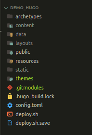

## Demo HUGO

this is a guide that is based on my article published on my [blog](https://juanmachuca95.github.io/posts/how_to_deploy_theme_loveit_in_github_pages/). 


### Estructure folder in local
this should be your local project structure <br>




### Script to deploy 
```bash
#!/bin/bash
function helpPanel() {
    echo -e "\nUsage: $0 [ -m MESSAGE ]" 1>&2
    echo -e "\tExample: ./deploy.sh -m "Descriptive message for commit""
    exit 1
}

while getopts "m:h" args; do 
    case $args in
        m) message=$OPTARG;;
        *) helpPanel;;
    esac
done

if [ "$message" == "" ]; then
    helpPanel
fi

# Run hugo to compile project 
hugo
if [ "$(echo "$?")" != "0" ]; then
    echo "Failed to compile hugo site, please check possibles errors before to deploy"
    exit 1;
fi

# Move to public 
cd public
# Check to folder .git is generated
test -d .git 
if [ "$(echo "$?")" == "1" ]; then 
    echo "Failed because folder .git is not generated"
    read -p "Do you want to run git init in public folder [ y/n ]" opt
    if [ "$opt" == "y" ]; then
        git init
        git branch -M main
        read -p "Repository remote: " opt
        if [ "$opt" != "" ]; then
            git remote add origin "$opt"
            # If you deploy project site then
            git branch gh-pages
            echo "👉 Creating branch - gh-pages"
        else 
            echo "Failed to set remote pository"
            exit 1;
        fi
    else 
        exit 1;
    fi
fi

echo -e "\n👉 Deploy in GitHub Pages from this proyect . . ."
echo -e "\nMessage commit: $message\n"
git add .  
git commit -m "$message"

git push origin main
# move to branch gh-pages

git checkout gh-pages
if [ "$(echo "$?")" == "1" ]; then 
    git branch gh-pages
    git checkout gh-pages
fi

# merge with main code
git merge main

# git push on gh-pages
git push origin gh-pages

git checkout main
cd .. 
exit 0

```

### How to run it?

```bash
chmod 755 deploy.sh

./deploy.sh -m "deploy hugo theme LoveIt in GitHub Pages"
```
